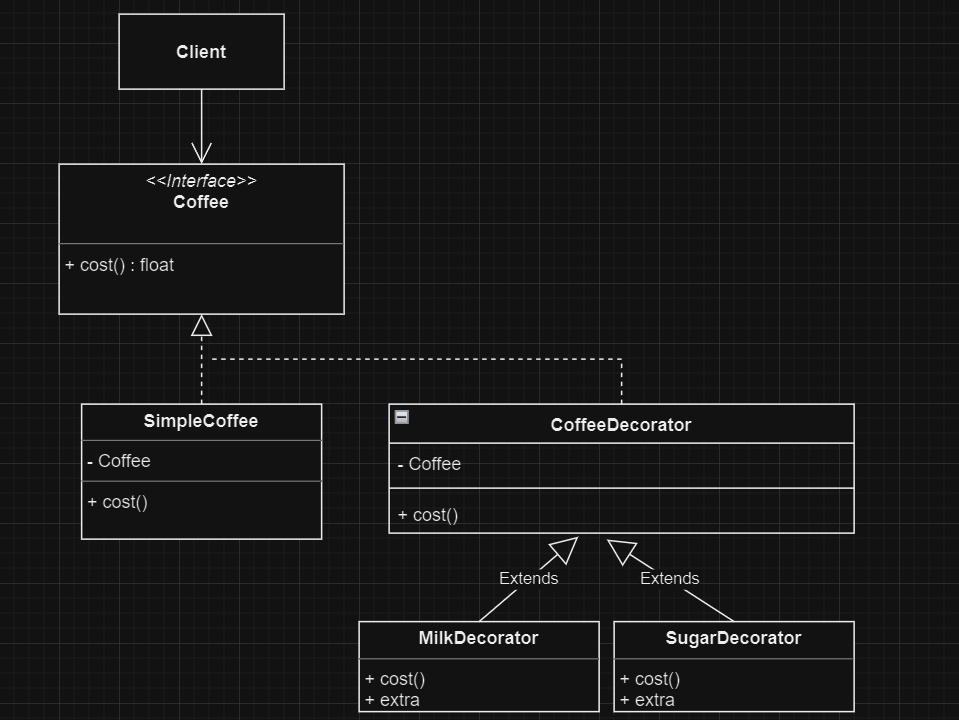

# Devoir DESIGN PATTERN

## Table des matières

- [Devoir DESIGN PATTERN](#devoir-design-pattern)
  - [Table des matières](#table-des-matières)
  - [Lancer le Projet](#lancer-le-projet)
  - [Questions :](#questions-)
    - [1](#1)
    - [2](#2)
    - [3](#3)
  - [Veille et présentation du design pattern "DECORATOR"](#veille-et-présentation-du-design-pattern-decorator)
    - [Contexte](#contexte)
    - [Avantages et inconvénients](#avantages-et-inconvénients)
      - [Avantages](#avantages)
      - [Inconvénients](#inconvénients)
    - [Implémenter le design pattern](#implémenter-le-design-pattern)
    - [Diagramme de classes UML](#diagramme-de-classes-uml)

## Lancer le Projet

Pour exécuter la démo, suivez ces étapes :

1. Assurez-vous d'avoir MAMP installé sur votre machine.
2. Clonez ce repository sur votre ordinateur.
3. Démarrez MAMP et assurez-vous que le serveur Apache est en cours d'exécution.
4. Placez le projet dans le répertoire approprié (généralement htdocs).
5. Accédez au projet via votre navigateur en utilisant l'URL appropriée (par exemple, http://localhost/chemin-vers-le-projet).

## Questions :

### 1

Les avantages que procure le fait de programmer vers une interface et non directement vers une implémentation sont : 

- La flexibilité, car cela permet au client de manipuler les mêmes interfaces (donc méthodes) en obtenant des comportements différents selon les besoins de l'utilisateur.

- L’extensibilité, car cela permet d’introduire de nouvelles implémentations de l’interface sans modifier le code existant. Cela facilite l’ajout de nouvelles fonctionnalités ou même la modification du comportement sans avoir d’impact sur le reste du système.

### 2

Préférer la composition (ou agrégation) à l'héritage est généralement recommandé pour une plus grande *flexibilité*. La composition, basée sur la relation “a-un”, permet des modifications de comportement à l'exécution, offrant une adaptabilité dynamique.
En revanche, l'héritage (relation “est-un” ou “se comporte comme”) nécessite des modifications avant exécution, générant un couplage fort et des changements complexes. 

La composition maintient l'encapsulation avec une visibilité "Black box", évitant les détails internes partagés, tandis que l'héritage expose l'interface et l'implémentation, entraînant une visibilité "White box" et une encapsulation brisée.

### 3

En programmation orientée objet, une interface est comme un contrat définissant un ensemble de méthodes que les classes qui implémentent cette interface doivent fournir. En d'autres termes, une interface définit un ensemble de comportements attendus, et toute classe qui prétend implémenter cette interface doit fournir une implémentation concrète pour chacune de ces méthodes.

## Veille et présentation du design pattern "DECORATOR"

Le décorateur est un patron de conception *structurel* qui permet d’affecter dynamiquement de nouveaux comportements à des objets en les plaçant dans des emballeurs qui implémentent ces comportements.

### Contexte 

Le design pattern "Decorator" est utilisé dans ce projet pour modéliser différentes variations de café. En effet, selon l'action du client, par exemple au Starbucks, sur la machine de commande selon si il prend différents type de café, il doit récupérer une décoration selon l'objet demandé. Par exemple le café simple est le composant de base, et les décorateurs ajoutent des fonctionnalités supplémentaires, telles que du lait ou du sucre, pour créer des combinaisons variées.

### Avantages et inconvénients

#### Avantages

- Extension sans Sous-classes : Vous pouvez étendre le comportement d'un objet sans avoir recours à la création d'une nouvelle sous-classe.

- Dynamisme des Responsabilités : Vous pouvez ajouter ou retirer dynamiquement des responsabilités à un objet au moment de l'exécution.

- Combinaison de Comportements : Vous pouvez combiner plusieurs comportements en emballant un objet dans plusieurs décorateurs.

- Principe de Responsabilité Unique : Principe de responsabilité unique. Vous pouvez découper une classe monolithique qui implémente plusieurs comportements différents en plusieurs petits morceaux.

#### Inconvénients

- Retrait Difficile : Retirer un emballeur spécifique de la pile n’est pas chose aisée.

- Comportement Dépendant de la Position : Il n’est pas non plus aisé de mettre en place un décorateur dont le comportement ne varie pas en fonction de sa position dans la pile.

- Configuration Initiale Complex : Le code de configuration initial des couches peut avoir l'air assez moche.

### Implémenter le design pattern 

Le code source est disponible dans le fichier [index.php](index.php).

### Diagramme de classes UML

